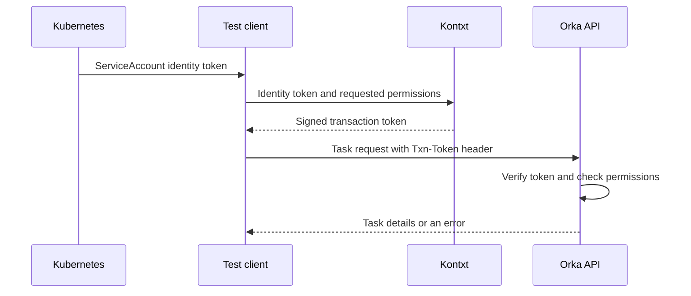

# Orka integration: Kontxt

This repository demonstrates how to authorize [Orka](https://github.com/orka-agents/orka) API requests with tokens from [Kontxt](https://github.com/aramase/kontxt). It includes configuration and an automated test that runs both services in a temporary Kubernetes cluster on your machine.

Orka runs work called **Tasks**, such as a container command or an AI agent. Kontxt is a **Transaction Token Service**, or TTS. It verifies a caller's identity and issues a short-lived, signed **transaction token**, or TxToken. The token carries the caller's identity, permissions, and a transaction ID that can follow the work across services.

## How it connects to Orka

Orka already supports the `transaction-token` authentication profile. Kontxt runs as a separate service; Orka uses configuration to trust the tokens it issues.



The test client runs inside Kubernetes. Its **ServiceAccount** is the identity Kubernetes assigns to that application. The client exchanges its Kubernetes identity token for a Kontxt transaction token, then sends that token directly to Orka in the `Txn-Token` HTTP header.

Orka verifies the token's signature, issuer, intended recipient, and expiry. It then checks **scopes**, which are named permissions such as `orka:tasks:list`. A token that only permits listing Tasks cannot create one. Tokens can also restrict requests to a Kubernetes **namespace**, a named group of resources.

For an allowed Task creation request, Orka runs the work and records the caller and transaction metadata on the Task. Kontxt handles token issuance; Orka handles authorization and execution.

## Run the smoke test

A smoke test checks that the components work together. This one creates a small container Task that verifies it received transaction metadata. It needs no AI model API keys or existing Kubernetes cluster.

Install these tools first:

| Tool | What it does here |
|---|---|
| [Docker](https://docs.docker.com/get-started/get-docker/) | Builds the application images and runs the local cluster. |
| [kind](https://kind.sigs.k8s.io/docs/user/quick-start/) v0.33.0 | Creates a Kubernetes cluster using Docker containers. |
| [kubectl](https://kubernetes.io/docs/tasks/tools/) | Sends commands to Kubernetes. |
| [Helm](https://helm.sh/docs/v3/intro/install/) v3.22.0 | Installs Orka using its packaged Kubernetes configuration, called a chart. |
| Git, Bash, curl, jq, OpenSSL | Download source, run the script, process configuration, and generate temporary test keys. |

The version pins are in [versions.env](versions.env). The test cluster uses Kubernetes v1.36.4. Docker builds the Go binaries and Orka UI.

Start Docker and check that `docker info` succeeds. Then clone this repository and run the test:

```bash
git clone https://github.com/orka-agents/orka-integration-kontxt.git
cd orka-integration-kontxt
./scripts/kind-ci.sh
```

If you already cloned the repository, run the script from its root directory. The first run can take several minutes while Docker downloads images and builds Orka.

The script automatically:

1. Checks out Orka's `main` branch by default and creates a new local cluster and container image registry.
2. Builds Orka and the test helper, then installs Orka and Kontxt. Orka's images and Helm chart come from the same source revision.
3. Runs the token and authorization checks, creates a Task, waits for it to finish, and deletes it.
4. Removes the test cluster, registry, and temporary files when the script exits.

All Kubernetes commands use a private configuration file for this test cluster. A successful run prints:

```text
Orka/Kontxt smoke passed
==> Kontxt compatibility passed against Orka <commit>
```

The commit identifies the Orka version tested. If a check fails, the script exits with an error and identifies the failed step. See the debugging option below to retain a cluster for inspection.

## What the test checks

| Check | Expected behavior |
|---|---|
| Identity exchange | A valid Kubernetes ServiceAccount token can be exchanged for a signed Kontxt token. |
| API permissions | Listing Tasks succeeds with the required scope. Requests without a token get `401`; missing permissions or the wrong namespace get `403`. |
| Task execution | A container Task receives transaction metadata, finishes successfully, and is deleted. Task responses must not contain raw tokens. |
| Reduced permissions | A replacement token can have fewer permissions while keeping the same transaction ID. Asking for broader permissions is rejected. |
| Verification by another service | A second test service accepts the restricted token and confirms its transaction ID and scope. |

The test client requests replacement tokens directly from Kontxt. The test does not cover AI model calls, GitHub Actions identity tokens, Orka's internal task delegation, or workers requesting replacement tokens themselves. See [compatibility and verification status](docs/compatibility.md) for the full coverage and tested versions.

## Configure your own Orka installation

The local test configures everything automatically. For another installation, connect Orka to your Kontxt service through Helm values under `controller.contextToken`:

| Setting | Meaning |
|---|---|
| `profile: transaction-token` | Enables Orka's transaction-token authentication. |
| `issuer` | The Kontxt issuer that Orka should trust. |
| `audience` | The intended token recipient, set to `orka` in this test. |
| `jwksUrl` | Where Orka finds the public signing keys used to verify tokens. |
| `headers: Txn-Token` | The HTTP header clients use to send their token. |
| `authzMode: enforce` | Rejects requests that violate the token's permissions or constraints. |
| `tts.endpoint` | The full Kontxt URL Orka uses for replacement tokens, ending in `/token_endpoint`. |

The bundled Kontxt deployment is a local test service built with the Kontxt library. For your own installation, configure which caller identities Kontxt trusts and which permissions it may issue. Follow the [provider configuration guide](docs/provider-notes.md) and [sample Helm values](manifests/orka/transaction-token-values.yaml) alongside your other Orka settings.

## Use a local Orka checkout

To test the committed `main` branch in an existing Orka clone, run this from the integration repository:

```bash
ORKA_REPOSITORY="$HOME/projects/orka" \
ORKA_REF=main \
./scripts/kind-ci.sh
```

Change the path to your Orka checkout. This still creates and removes a temporary cluster. It tests the committed source at `ORKA_REF`; save and commit code changes before testing them. You can also set `ORKA_REF` to a tag or commit. See [source and image overrides](docs/compatibility.md#select-the-source-and-images) for other options.

<details>
<summary>Keep a cluster for debugging with kindctl</summary>

If you use kindctl, create a cluster associated with this checkout and let the runner use it:

```bash
kindctl create --tag kontxt-main --k8s-version v1.36.4
kontxt_context="$(kindctl kubectl --tag kontxt-main config current-context)"

ORKA_REPOSITORY="$HOME/projects/orka" \
ORKA_REF=main \
KIND_USE_EXISTING=1 \
KIND_CLUSTER_NAME="${kontxt_context#kind-}" \
kindctl exec --tag kontxt-main -- ./scripts/kind-ci.sh
```

Use a fresh cluster; setup refuses existing `orka-system` or `vekil-system` namespaces. This mode keeps the cluster, registry, and run directory for inspection. Use the same tag to inspect and delete the cluster:

```bash
kindctl kubectl --tag kontxt-main get pods -A
kindctl delete --tag kontxt-main
```

After deleting the cluster, also delete the registry container and run directory named in the script's final output. That directory contains temporary test keys.

</details>

To change the integration or add tests, see [CONTRIBUTING.md](CONTRIBUTING.md).
